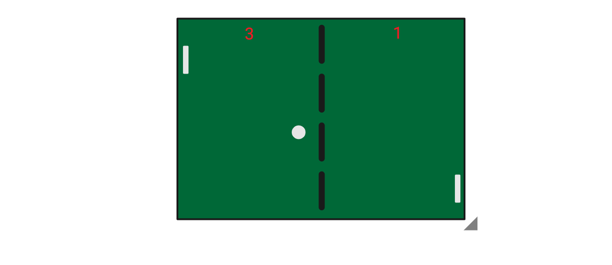

# A Simple Game of Ping Pong

## Wireframe

## Tech Stack
* HTML
* CSS
* Vanilla JavaScript

## MVP Goals
* Create the game using canvas
* Display a ping pong board in the browser
* Display two rectangles as the paddle
* Display a ball that moves 45°
* Implement collision detection and have the ball bounce if it hits the paddle
* Implement collision detection and have the ball bounce if it top and bottom boundaries
* Implement collision detection if ball hits the left and right boundaries
* Enable two players
* Left paddle will use keys "w" to go up "s" to go down
* Right paddle will use arrow up and arrow down
* Display a scoreboard

## Stretch Goals
* Implement an AI 

